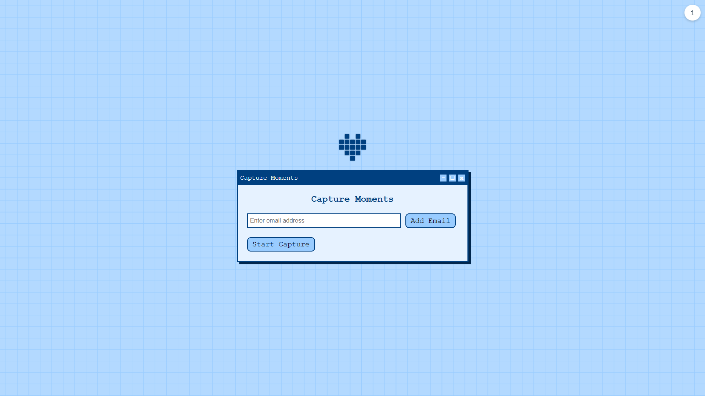

# Capture Moments

## Overview
Capture Moments automatically takes screenshots at random intervals during a video call and emails them to specified recipients.

## Features
- Auto-capture screenshots during video calls.
- Compress screenshots into a ZIP file.
- Send screenshots via email.

## Installation & Run
1. Backend

    ```
    cd backend
    npm install
    nodemon start
    ``````
2. Frontend
    ```
    cd frontend
    npm install
    npm run dev
    ```

## Preview
